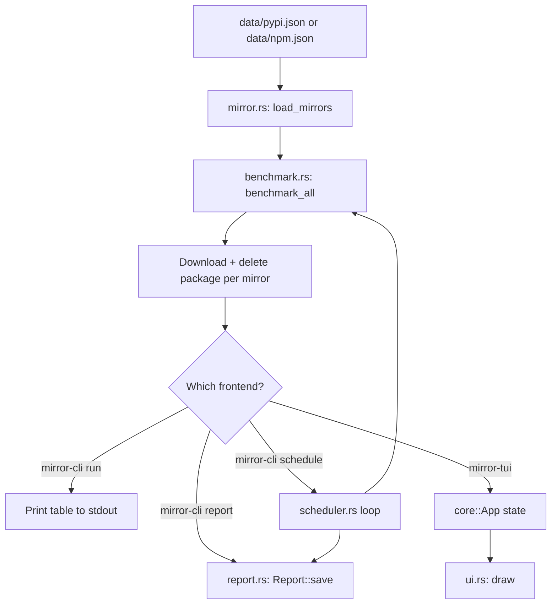

# Architecture

## Workspace Layout

The project is a Cargo workspace with three crates:

| Crate         | Binary        | Responsibility                                                   |
|---------------|---------------|------------------------------------------------------------------|
| `mirror-core` | (library)     | Shared application/domain logic (benchmarking, mirrors, reports, scheduler, pip) |
| `mirror-cli`  | `mirror-cli`  | Non-interactive CLI built on `clap` + `mirror-core`              |
| `mirror-tui`  | `mirror-tui`  | Interactive Ratatui application built on `ratatui` + `crossterm` + `mirror-core` |

```text
                  ┌──────────────────┐
                  │   mirror-core    │
                  │                  │
                  │ benchmark logic  │
                  │ mirror logic     │
                  │ scheduler        │
                  │ reports          │
                  │ application state│
                  └────────┬─────────┘
                           │
                 ┌─────────┴─────────┐
                 │                   │
        ┌────────▼────────┐  ┌───────▼────────┐
        │   mirror-cli    │  │   mirror-tui   │
        │                 │  │                │
        │ clap            │  │ ratatui        │
        │ stdout          │  │ crossterm      │
        │ exit codes      │  │ event handling │
        └─────────────────┘  └────────────────┘
```

## Dependency Rules

* `mirror-core` MUST NOT depend on `ratatui` or `crossterm`.
* `mirror-cli` MUST NOT depend on `ratatui` or `crossterm`.
* `mirror-tui` depends on `mirror-core`, `ratatui`, and `crossterm`.

## Modules

### `mirror-core` (library)

| Module          | Responsibility                                              |
|------------------|--------------------------------------------------------------|
| `app.rs`         | Core application state (selection, results, benchmark loop)  |
| `benchmark.rs`   | Downloads a real package from each mirror and measures latency |
| `config.rs`      | Reads env-driven tuning (timeout, attempts, schedule interval) |
| `mirror.rs`      | Loads the sample package name + mirror URL list from the registry dir |
| `npm.rs`         | Installs npm packages via configured mirrors with fallback  |
| `pip.rs`         | Installs pip packages via configured mirrors with fallback  |
| `report.rs`      | Builds and saves JSON reports to `reports/`                   |
| `scheduler.rs`   | Infinite benchmark/report/sleep loop                          |

### `mirror-cli` (binary)

| Module          | Responsibility                                              |
|------------------|--------------------------------------------------------------|
| `main.rs`        | CLI parsing (`clap`) and dispatch to `mirror-core` commands  |

### `mirror-tui` (binary)

| Module          | Responsibility                                              |
|------------------|--------------------------------------------------------------|
| `main.rs`        | Terminal setup/cleanup, event loop, wraps `mirror-core::App` |
| `ui.rs`          | Renders the TUI with `ratatui`                                |

## Data Flow



`load_mirrors` returns a `MirrorConfig { package, mirrors }` loaded from
the package manager's JSON file, so every downstream consumer knows both
which mirrors to test and which package to actually download from them.

The CLI and TUI both call into the same `mirror-core` operations; they
differ only in how they present results to the user.

## Data Files

Mirror lists live in `pypi.json` and `npm.json` under the configured registry
directory. The `MIRROR_DATA_DIR` environment variable overrides the default
directory `./data`.

Both files retain the same shape and define the sample `package` and ordered
`mirrors` list for their package manager.

Reports are written under `reports/`. `MIRROR_REPORTS_DIR` can override the
report output directory.

## Benchmark Process

Benchmarking downloads a real package file from each mirror (never
installing it) so latency reflects an actual `pip install` / `npm install`
workflow rather than a bare HTTP ping.

For each mirror URL:

1. Build a `reqwest::Client` with a `MIRROR_TIMEOUT_SECS`-second timeout
   (default 15).
2. Run `MIRROR_ATTEMPTS` attempts, one at a time (default 3). Each attempt:
   1. Resolves the package's direct download URL on that mirror:
      - **PyPI**: fetches the PEP 503 "simple" index page
        (`{mirror}{package}/`) and extracts the first `href` pointing at
        a `.whl`/`.tar.gz`/`.zip`/`.egg` archive, resolving relative URLs
        against the index page.
      - **npm**: fetches the registry's `{mirror}{package}/latest`
        shortcut and reads `dist.tarball` from the returned JSON.
   2. Downloads the resolved file's full bytes.
   3. Writes the bytes to a uniquely-named file in the OS temp directory,
      then immediately deletes it.
   4. Records elapsed time via `Instant`, covering the resolve + download
      + delete round trip.
3. Average the latency across successful attempts.
4. If all attempts fail (timeout, DNS error, connection refused, no
   archive found, malformed metadata), the mirror is marked
   `timed_out = true` with `success_rate = 0`.
5. Results are sorted by latency ascending, with timed-out mirrors sorted
   last regardless of latency value.

A single mirror failure never aborts the run — each mirror is benchmarked
independently and errors are captured into the result struct rather than
propagated.

Note: if a mirror's index/metadata doesn't rewrite package URLs to itself,
the actual file download may hit the origin host rather than the mirror's
own CDN. This mirrors real package-manager behavior against that mirror,
but is worth keeping in mind when interpreting results for mirrors that
only proxy metadata.

## Report Generation

`report.rs` converts a `Vec<BenchmarkResult>` into a `Report` struct
containing the package manager name, an RFC 3339 timestamp, per-mirror
entries, and the fastest reachable mirror. The report is serialized with
`serde_json` and written to `reports/YYYY-MM-DD_HH-MM.json`, creating the
`reports/` directory if it doesn't exist.

## Scheduler

`scheduler.rs` runs an infinite loop: for each package manager (pypi, then
npm), load mirrors, benchmark, and save a report. After both have run, it
sleeps for `MIRROR_SCHEDULE_INTERVAL_SECS` seconds (default one hour, via
`tokio::time::sleep`) and repeats. There is no cron
integration or daemonization — the process must stay running in the
foreground (or under a process manager of the user's choosing).

## Configuration

`config.rs` resolves env-driven tuning in `mirror-core`, applying the default
for any value that is unset, empty, non-numeric, or not positive.

| Variable                          | Meaning                              | Default |
|-----------------------------------|--------------------------------------|---------|
| `MIRROR_DATA_DIR`                 | Directory holding the registry JSON  | `./data` |
| `MIRROR_REPORTS_DIR`              | Directory for generated reports      | auto-detected `reports/`  |
| `MIRROR_TIMEOUT_SECS`             | Per-attempt HTTP timeout             | `15`                      |
| `MIRROR_ATTEMPTS`                 | Attempts per mirror                  | `3`                       |
| `MIRROR_SCHEDULE_INTERVAL_SECS`   | Delay between scheduler cycles       | `3600`                    |
